## OAuth2 接入参考
观猹提供标准 OAuth2 Authorization Code 授权模式，支持 PKCE 扩展，适用于 Web 应用、移动 App 等场景。

### 授权流程

```mermaid
sequenceDiagram
    participant App as 第三方应用
    participant User as 用户
    participant Watcha as 观猹认证服务器

    App->>User: 跳转授权页 GET https://watcha.cn/oauth/authorize...
    User->>Watcha: 登录并确认授权
    Watcha-->>App: 重定向至 redirect_uri?code=AUTH_CODE&state=...

    App->>Watcha: POST /oauth/api/token 使用 AUTH_CODE 换取 Token
    Watcha-->>App: 返回 AccessToken / RefreshToken

    App->>Watcha: GET /oauth/api/userinfo 携带 AccessToken
    Watcha-->>App: 返回用户信息

```


### 接入准备

当前还未实现 OAuth2 前端管理页面，因此请填写申请表 [观猹 OAuth2.0 服务开通信息收集表](https://agentuniverse.feishu.cn/share/base/form/shrcnHJ3ATlNg6ofNHssT2zK7Dh) 并联系观猹官方人员对接，提供如下信息创建客户端：


| 参数      | 类型    | 必填 | 说明 |
| --------- | ------- | ---- | ---- |
| name      | string  | 是   | 应用名称，将在授权页面展示 "{name} 请求获取权限" |
| domain    | string  | 是   | 回调地址的 URI Schema，例如 http://localhost:3000 |
| scope     | string  | 是   | 申请的权限范围，多个值用空格分隔。可选值：`read`（基础信息）、`email`（邮箱）、`phone`（手机号） |
| is_public | boolean | 否   | 是否为公开客户端（默认 false） |


- 机密客户端(is_public=false)：有后端能安全存储 client_secret
- 公开客户端(is_public=true)：无法安全存储 secret，如纯前端应用，流程中必须使用 PKCE 进行认证

创建完成后将提供 client_id 和 client_secret，请妥善保存


### 1. 应用通过 浏览器 或 Webview 将用户引导到授权页面上
> 可下载并使用该观猹小图标： https://watcha.tos-cn-beijing.volces.com/products/logo/1752064513_guan-cha-insights.png?x-tos-process=image/resize,w_720/format,webp

```text
GET https://watcha.cn/oauth/authorize?
  response_type=code&
  client_id=your_client_id&
  redirect_uri=https://myapp.com/callback&
  scope=read&
  state=random_string&
  code_challenge=E9Melhoa2OwvFrEMTJguCHaoeK1t8URWbuGJSstw-cM&
  code_challenge_method=S256
```

参数说明

|参数                   |类型    |必填     |说明                                    |
|---------------------|------|-------|--------------------------------------|
|response_type        |string|是      |固定为 `code`                            |
|client_id            |string|是      |客户端 ID                                |
|redirect_uri         |string|是      |回调地址，需与注册时的 domain 匹配                 |
|scope                |string|否      |权限范围，多个值用空格分隔，详见 [Scope 说明](#scope-说明)  |
|state                |string|否，推荐填写 |随机字符串，用于防止 CSRF攻击                     |
|code_challenge       |string|公开客户端必填|PKCE code_challenge 私密客户端也可填写，进一步加强安全性|
|code_challenge_method|string|公开客户端必填|`S256` 或 `plain`（推荐 S256）             |

### Scope 说明

Scope 用于控制第三方应用可获取的用户信息范围。用户在授权页面上会看到应用请求的具体权限，并可选择是否同意。

#### 可用 Scope

| Scope   | 说明                     | 返回字段                         |
| ------- | ------------------------ | -------------------------------- |
| `read`  | 基础用户信息（默认）      | `user_id`、`nickname`、`avatar_url` |
| `email` | 用户邮箱                 | `email`                          |
| `phone` | 用户手机号               | `phone`                          |

- `read` 为基础权限，始终建议包含
- 多个 scope 之间用**空格**分隔，例如 `scope=read email phone`
- scope 值在 URL 中传递时，空格会被编码为 `%20` 或 `+`

#### 示例

仅获取基础信息：
```text
scope=read
```

获取基础信息 + 邮箱 + 手机号：
```text
scope=read email phone
```

#### 授权页面行为

用户在授权页面上会看到应用请求的权限列表。如果请求了 `email` 或 `phone`，用户需要明确同意后，应用才能获取对应信息。

### 2. 接收授权回调

用户授权后，观猹认证服务器将用户重定向到 `redirect_uri`，并附带授权码：

```text
https://myapp.com/callback?code=AUTH_CODE&state=random_string
```

如果用户拒绝授权或出现异常，重定向时会带上错误信息：

```text
https://myapp.com/callback?error=access_denied&error_description=用户拒绝授权&state=random_string
```

### 3. 使用授权码换取 Token

```text
POST https://watcha.cn/oauth/api/token
Content-Type: application/x-www-form-urlencoded

grant_type=authorization_code&
code=AUTH_CODE&
redirect_uri=https://myapp.com/callback&
client_id=your_client_id&
client_secret=your_client_secret&
code_verifier=your_code_verifier
```

参数说明

|参数           |类型    |必填         |说明                      |
|-------------|------|-----------|------------------------|
|grant_type   |string|是          |固定为 `authorization_code`|
|code         |string|是          |授权码                     |
|redirect_uri |string|是          |回调地址（需与授权请求一致）          |
|client_id    |string|是          |客户端 ID                  |
|client_secret|string|机密客户端必填    |公开客户端无需填写               |
|code_verifier|string|使用 PKCE 时必填|PKCE code_verifier      |

成功响应
```json
{
  "access_token": "XXXX",
  "token_type": "Bearer",
  "expires_in": 1800,
  "refresh_token": "XXXXX",
  "scope": "read email phone"
}
```

> `scope` 字段反映实际授予的权限范围，可能与请求的 scope 不同（取决于用户授权的范围）。

异常响应
```json
{
  "error": "invalid_grant",
  "error_description": "Token 生成失败: invalid authorize code"
}
```

### 4. 通过 AccessToken 获取已授权用户的信息
```bash
GET https://watcha.cn/oauth/api/userinfo?access_token=your_access_token
```

成功响应（scope 包含 `read email phone` 时）
```json
{
  "statusCode": 200,
  "data": {
    "user_id": 12345,
    "nickname": "用户昵称",
    "avatar_url": "https://watcha.tos-cn-beijing.volces.com/dev/user/profile/avatar/12000000_1757187302_user_12000000.png",
    "email": "user@example.com",
    "phone": "13800138000"
  }
}
```

> **注意：** `email` 和 `phone` 字段仅在授权时请求了对应 scope 且用户同意后才会返回。此外，观猹用户可能仅绑定了手机号或仅绑定了邮箱，若用户未绑定对应信息，即使授权了相应 scope，响应中也不会包含该字段。第三方应用需自行处理字段缺失的情况，不应假设这些字段一定存在。

异常响应
```json
{
  "statusCode": 400,
  "code": "ERROR",
  "message": "无效的 access_token"
}
```

字段说明

|参数        |类型    |说明                              |
|----------|------|---------------------------------|
|user_id   |number|用户唯一标识（用于关联账号）                  |
|nickname  |string|用户昵称                            |
|avatar_url|string|头像 URL，存在时才返回                   |
|email     |string|用户邮箱，需 `email` scope，授权后才返回     |
|phone     |string|用户手机号，需 `phone` scope，授权后才返回    |

### 刷新 AccessToken
```text
POST https://watcha.cn/oauth/api/token
Content-Type: application/x-www-form-urlencoded

grant_type=refresh_token&
refresh_token=your_refresh_token
```

参数说明

|参数           |类型    |必填|说明                 |
|-------------|------|--|-------------------|
|grant_type   |string|是 |固定为 `refresh_token`|
|refresh_token|string|是 |RefreshToken       |

成功响应
```json
{
  "access_token": "XXXX",
  "token_type": "Bearer",
  "expires_in": 1800,
  "refresh_token": "XXXX",
  "scope": "read"
}
```

异常响应
```json
{
  "error": "invalid_grant",
  "error_description": "Token 刷新失败: invalid refresh token"
}
```

### 校验 Token 是否有效
```text
POST https://watcha.cn/oauth/api/introspect
Content-Type: application/x-www-form-urlencoded

token=your_token&
token_type_hint=access_token
```

参数说明

|参数             |类型    |必填|说明                              |
|---------------|------|--|--------------------------------|
|token          |string|是 |要验证的 token                      |
|token_type_hint|string|否 |`access_token` 或 `refresh_token`|

响应 — Token 已失效
```json
{
  "statusCode": 200,
  "data": {
    "active": false
  }
}
```

响应 — access_token 有效
```json
{
  "statusCode": 200,
  "data": {
    "active": true,
    "scope": "read",
    "client_id": "your_client_id",
    "token_type": "access_token",
    "expired_at": 1770054311
  }
}
```

响应 — refresh_token 有效
```json
{
  "statusCode": 200,
  "data": {
    "active": true,
    "scope": "read",
    "client_id": "your_client_id",
    "token_type": "refresh_token",
    "expired_at": 1770054311
  }
}
```

## 常见问题
### 开发环境如何测试？

可使用下列信息进行接入测试：

| 类型         | client_id           | client_secret                         |
| ------------ | ------------------- | ------------------------------------- |
| 机密客户端   | 1p9Mcr+CNLPAMFC0    | aqkUs+5ZGLSVG6A/L/I0ib9uownWxH+w      |
| 公开客户端 | 3p9Mcr+CNLPAMFC0    |                                       |

### 存量 Client 如何获取用户 phone 和 email？
> 适用于 2026 年 3 月 30 日前接入上线的 Client

已接入的存量客户端默认仅拥有 `read` scope，如需获取用户的邮箱或手机号，需要完成以下两步：

1. **联系运营开通 scope**：联系观猹官方人员，申请为已有 client_id 增加 `email` 或 `phone` scope 权限
2. **修改授权请求参数**：在跳转授权页面时，将 `scope` 参数中增加所需的权限值，例如将 `scope=read` 改为 `scope=read email phone`

两步缺一不可——未开通 scope 时传参无效，已开通但未传参也不会返回对应字段。

### 提示"客户端不存在"？

client_id 中可能包含 `+`、`/`、`=` 等特殊字符，在 URL 中传递时需要进行 URL 编码，否则服务端会解析失败。

例如 client_id 为 `1p9Mcr+CNLPAMFC0`，编码后应为 `1p9Mcr%2BCNLPAMFC0`（`+` → `%2B`）。

各语言示例：

```javascript
// JavaScript
encodeURIComponent(clientId)
```

```python
# Python
from urllib.parse import quote
quote(client_id, safe='')
```

```go
// Go
url.QueryEscape(clientId)
```
