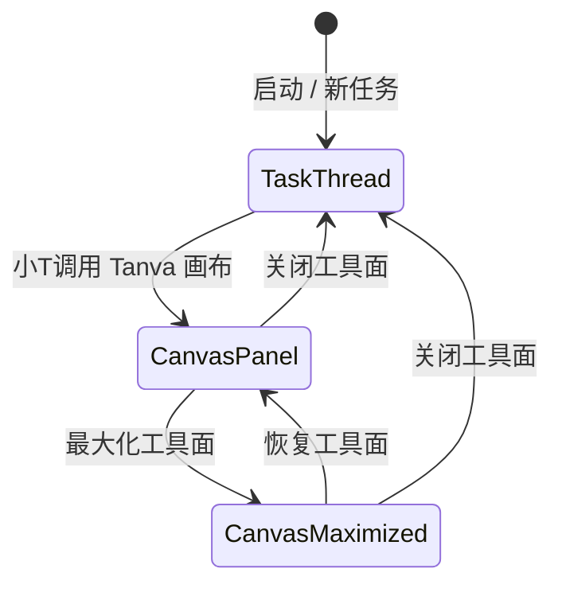

# Tanva 桌面端 Codex 式任务外壳与画布工具面架构

> 状态：产品与交互设计 v0.6；Electron M1 基础已实现（2026-08-21）  
> 范围：桌面外壳、小T、Tanva 画布工具面、任务运行时与首批 JZXZ 能力包  
> 实现说明：Electron 外壳、内置工具面插件合同、Tanva 画布插件和自动唤起链路已经落地；外部插件安装、签名和独立进程 Host 仍属于后续阶段。

## 1. 产品结论

Tanva 桌面版不是“把当前网页套进一个窗口”，也不是复制 JZXZ 的完整界面。整体框架与 Codex 桌面端的任务会话模型对齐：用户始终工作在一个小T任务线程中，画布、资料预览与后续专业工具按需作为侧面工具面打开。目标产品由四个稳定角色组成：

1. **小T是唯一 AI 对话核心**：理解目标、读取当前项目事实、选择技能和工具、编排工作流、解释过程并请求必要确认。
2. **Tanva 画布是小T的第一方内置插件**：对应 Codex 在任务线程中调用的浏览器模块，通过与后续工具相同的工具面插件合同注册，可在当前任务右侧打开、收起、恢复和最大化，管理项目、工作流、素材与图片/视频等产物。它不是一级导航；M0 作为随应用发布的内置插件，不提供卸载。
3. **JZXZ 是第一批能力参考**：优先吸收专业软件 MCP、本机运行时、动态 Skills、本地 RAG 和 CAD/3D 交付证据能力，不复制其产品外壳、聊天或画布。
4. **任务运行时是异步执行事实源**：所有长任务具有稳定任务身份、真实状态、进度证据、结果和错误；界面通过线程内工具活动与左侧任务历史呈现，不能用聊天正文冒充执行完成。

产品公式：

```text
Tanva Desktop
= Codex 式任务会话外壳
+ 小T 智能编排核心
+ Tanva 第一方画布插件
+ 可安装能力包
+ 可观察、可恢复的任务运行时
```

### 1.1 Codex 对齐映射

| Codex 框架对象 | Tanva 对应对象 | 产品含义 |
|---|---|---|
| Thread / Task | 小T任务线程 | 一个目标、一份连续上下文、一组工具活动与产物 |
| 左侧任务边栏 | Tanva 任务历史 | 新任务、搜索、置顶/最近任务、未读与恢复 |
| Composer | 小T输入器 | 输入目标、附件、语音、项目上下文和发送 |
| Project picker | Tanva 项目上下文 | 为当前线程绑定项目、Flow/章节和素材权限范围 |
| Tool activity | 小T能力调用记录 | JZXZ、图片、视频、检索与画布调用的状态和证据 |
| Browser side panel | Tanva 画布插件工具面 | 小T按需打开的第一方可交互工作表面 |
| Artifact side panel | 文件工作台 | PPT、Excel、文档的预览、导出与画布交接 |
| Maximize side panel | 最大化 Tanva 画布 | 保留任务外壳的沉浸式节点操作，不建立独立画布模式 |
| Bottom/background panel | 高级运行详情 | 仅在需要时查看日志、后台进程与诊断，不成为普通用户主入口 |

### 1.2 Tanva 视觉延续合同

桌面端的信息架构直接采用 Codex 的“任务边栏 + 当前任务线程 + 可开合侧面工具面”关系，但视觉系统必须延续当前 Tanva 工作区，不能复制 Codex 或 ChatGPT 的品牌皮肤。

| 视觉维度 | Tanva 既有事实 | 桌面端应用方式 |
|---|---|---|
| 品牌 | 几何蓝色 Tanva 图形标与 TANVA 字标 | 使用现有品牌资产，不用字母 T 或第三方风格旋涡替代 |
| 画布 | 全屏纯白创作面；可切换 Premium Black `#090909` | 对话态仍保留“无边界工作台”的空间感，不做米白色后台页面 |
| 浮层 | 独立悬浮胶囊/卡片，16px 圆角，细边框，轻阴影 | 顶栏、模式切换、画布工具与小T使用同一液态玻璃材质 |
| 玻璃 | 低透明白、轻模糊、低饱和度边框 | 避免厚重实色侧栏；内容之上悬浮而不切断画布 |
| 强调色 | Tanva 品牌蓝与少量状态色 | 品牌蓝只用于选中、主动作和关键连接，不改成薄荷绿主色 |
| 小T | 半透明对话面板、彩雾任务光环、圆形操作按钮 | 任务输入器与工具活动沿用同一组件气质；不在画布里再放第二个聊天窗 |
| 画布工具 | 小尺寸圆形按钮组、轻量悬浮工具条 | 节点创建和视图工具继续使用 Tanva 现有操作密度 |
| 节点 | React Flow 白色卡片、细描边、端口、媒体预览 | 保持既有节点类型外观，不设计另一套通用流程卡 |
| 字体 | Inter / system-ui，冷灰文字层级 | 不使用编辑杂志式衬线标题或夸张展示字体 |

禁止项：米白暖色整页、薄荷绿品牌替换、传统后台式满高侧栏、厚重导航分割、过度卡片化首页、与现有画布不一致的节点皮肤。

## 2. Codex 式任务壳层与画布工具面

产品只有一个主框架：任务会话。下列三个画面是同一任务外壳中的工具面展开程度，不是用户需要选择的三种产品模式，也不存在“对话 / 协作 / 画布”全局切换器。

### 2.1 任务线程：默认工作面


目标：像 Codex 一样，让用户从“新任务”开始，在一个持续线程里提出目标、补充材料、查看计划和接收结果。

- 左侧边栏承担新任务、搜索、Work 项目/任务、Chat 任务、扩展管理与账号/团队切换。
- 中间是当前小T任务线程；标题、项目上下文、对话、工具活动和输入器属于同一个线程。
- 任务拖入项目即成为 Work，拖回 Chat 即解除项目绑定；Work 仍可在线程标题中调整项目上下文。
- 长任务的进度以线程内工具活动呈现，跨任务管理仍可从任务历史和统一搜索进入。
- 能力由小T按需调用，不展示能力宫格、工作流模板大厅或插件品牌快捷入口。
- 默认不加载 Tanva 画布，用户不需要先理解节点才能开始。

### 2.2 画布侧面工具面：小T调用后打开


目标：复用 Codex 调用浏览器后的同屏关系——任务线程保留在中间，Tanva 画布作为右侧工具面承载可交互的真实项目内容。

- 小T根据用户目标调用 Tanva 画布；线程中出现一条可审计的工具活动，而不是跳转到另一个页面。
- 右侧工具面顶部只有画布标题、当前项目、最大化和关闭；不出现地址栏，也不出现全局画布导航。
- 画布负责项目事实、节点、连线、选区、执行状态和媒体结果；对话负责目标、解释、确认和异常处理。
- 对话产物卡能定位到真实节点或资产，画布选区能成为当前任务的轻量上下文。
- 关闭工具面只关闭可视区域，不中断任务，不清除选区、视口或线程上下文。
- 工具面宽度可拖动；同一任务同时只存在一个 Tanva 画布工具面实例。

### 2.3 最大化画布工具面：沉浸操作


目标：复杂节点编排需要空间时，最大化当前侧面工具面，而不是进入另一套“画布模式”。

- 左侧任务边栏仍保留，表明用户没有离开任务外壳。
- 当前任务线程暂时让出主空间；恢复工具面后回到原线程与分栏宽度。
- 画布顶部只保留恢复和关闭两个面板级动作。
- 创建节点只从画布唯一“添加”入口展开；编辑、运行、版本、复制等动作只出现在选中节点的内联工具条。
- 最大化、恢复、关闭都只是工具面布局状态，不创建会话、不复制项目、不重新运行任务。

## 3. 唯一入口合同

“一个功能只有一个唯一入口”是桌面端的硬约束。这里的入口指用户可主动触发该功能的可见控件；状态文本、结果展示和快捷键提示不能偷偷变成第二个操作入口。

| 功能 | 唯一入口 | 状态归属 | 明确删除的重复入口 |
|---|---|---|---|
| 新建任务 | 左侧边栏“＋ 新任务” | 新的小T任务线程 | 首页按钮、空态卡片、右键快捷项 |
| 搜索 | 左侧边栏“搜索 / ⌘K” | 任务与项目统一搜索层 | 顶部搜索框、项目内第二搜索框、能力搜索按钮 |
| 选择项目上下文 | 左侧拖入项目；Work 标题栏可调整 | 当前 Work 任务线程 | 画布内项目切换器、重复项目首页 |
| 打开/收起 Tanva 画布 | 当前任务顶栏唯一“画布”开关；小T自动调用复用同一实例 | 当前任务的右侧工具面 | 全局画布导航、扩展列表启动按钮、独立画布首页 |
| 最大化/恢复画布 | 画布工具面标题栏的单一展开控件 | 当前画布工具面 | 全屏入口、模式切换器、节点内全屏按钮 |
| 关闭画布 | 画布工具面标题栏关闭按钮 | 当前画布工具面 | 浮动小T关闭、画布底部关闭、返回对话按钮 |
| 查看与切换任务 | 左侧任务历史 | 任务线程列表 | 独立任务中心首页、底部任务托盘、画布任务浮层 |
| 调用 AI 能力 | 小T自然语言对话 | 当前小T会话 | 选择能力、能力快捷按钮、节点外插件启动器、JZXZ独立聊天入口 |
| 管理能力包 | 全局“扩展” | 扩展中心；只管理，不直接启动能力 | 设置中的第二套插件页、画布插件市场按钮、扩展列表内的平行启动按钮 |
| 添加附件 | 小T输入框的回形针 | 当前消息草稿 | 独立上传按钮、能力卡上传按钮；拖放只是同一入口的无按钮手势 |
| 管理项目资料 | 画布工具面内“资料” | 当前项目 | 全局“资产”、首页素材区、第二资产库 |
| 创建画布节点 | 画布顶部“＋ 添加” | 当前画布 | 多组散落的新建节点按钮、空白区快捷卡、浮动小T节点按钮 |
| 运行节点 | 选中节点的内联“运行” | 当前节点 | 画布全局运行按钮、对话结果卡运行按钮 |
| 导出项目结果 | 项目标题栏“导出” | 当前项目 | 节点卡导出、任务卡导出、资产卡重复导出 |
| 账号与设置 | 左下角用户头像 | 当前账号 | 顶部齿轮、扩展页设置、第二头像菜单 |

补充约束：

- `⌘K 搜索`只负责查找并展示结果，不直接执行能力、创建项目或运行节点；操作仍回到对应唯一入口。
- 小T可以在用户授权后代为调用项目、画布与能力，但这是同一对话入口的编排结果，不新增可见入口。
- 插件只能贡献能力、节点类型、设置项和结果渲染器，不能向全局导航、标题栏或输入框注入新的同义入口。
- 快捷键可以映射到既有唯一入口，但必须与该入口共享同一动作、权限检查和状态，不形成平行业务链。

## 4. 工具面生命周期合同



工具面展开、恢复和关闭时必须保留：

- 当前用户与团队身份；
- 当前项目、Flow 和章节作用域；
- 小T会话身份；
- 当前选中节点与画布视口；
- 已受理任务的稳定任务 ID；
- 草稿输入、附件和尚未提交的编辑；
- 后台任务与失败证据。

禁止在工具面变化时：

- 新建一条平行 AI 会话；
- 重复提交图片或视频任务；
- 把 `queued` / `running` 显示成完成；
- 把临时 `data:`、`blob:` 或 base64 写入项目设计 JSON；
- 因关闭画布工具面而取消服务端任务。

## 5. 信息架构

| 层级 | 用户看到的对象 | 系统职责 |
|---|---|---|
| 任务边栏 | 新任务、搜索、任务历史、扩展、账号 | Codex 式稳定外壳；不接受插件动态扩张 |
| 小T任务线程 | 会话、项目上下文、计划、确认、工具调用摘要 | 语义理解、技能选择和工作流编排 |
| 项目 | 项目、章节、Flow、资料、项目上下文 | 创作事实、素材与权限作用域 |
| 插件工具面 | Tanva 画布及后续专业工作面 | 对应 Browser panel 的统一宿主；同一时刻只激活一个工具面 |
| 工具活动 | queued/running/needs_input/succeeded/failed/cancelled | 当前线程中的异步执行真相与恢复入口 |
| 资产 | 文档、图片、视频、音频、导出物 | 稳定远程资产与版本关系 |
| 能力 | 内置工具、JZXZ、未来插件 | 可授权、可审计、可升级的执行能力 |

## 6. Tanva 画布的第一方内置插件

以下名称用于表达目标能力边界，后续应由真实 schema 固化，不应直接作为未经验证的实现 API：

```text
canvas.window.show / hide / focus
project.list / create / open / inspect
canvas.selection.get / focus
canvas.node.create / update / connect / run
canvas.workflow.run / inspect / cancel
asset.import / inspect / add_to_canvas / export
task.inspect / cancel / reveal_result
```

关键规则：

- 小T调用画布必须携带真实项目/Flow/章节作用域。
- 节点与资产通过稳定 ID 关联；不在提示词和设计 JSON 中传递存储 URL。
- 图片、视频等正式资产持久化前必须托管，设计 JSON 只保存远程 URL/路径引用和必要变换参数。
- 画布操作的结果必须回传节点、任务或资产证据，不能只返回自然语言“已完成”。
- 删除、覆盖、回滚、发布等高风险操作继续要求明确目标和用户授权。

## 7. JZXZ 首批能力包

JZXZ 的价值应被拆成能力协议，而不是把原产品的窗口和导航嵌入 Tanva。

### 7.1 安装包验证后的第一批能力

| 能力域 | 首批动作 | 在界面中的表现 |
|---|---|---|
| 专业软件 MCP | SketchUp、Rhino、Grasshopper、AutoCAD、Photoshop | 小T调用、连接管理、权限确认、工具活动证据 |
| 本机运行时 | 受控 Node/Python 任务与文件转换 | 独立 Capability Host；不进入 Renderer |
| Skills | 动态技能发现、版本与适用范围 | 小T能力清单；不新增聊天入口 |
| 知识库/RAG | 本地嵌入、项目索引、检索、带来源回答 | 项目资料与引用卡；不新增能力入口 |
| CAD/3D 交付 | DXF/DWG/3DM/SKP 检查、预览和导出 | 当前任务的工具活动与 Tanva 项目资产 |

完整证据、开源候选和 Tanva 映射见 `03-JZXZ能力拆解与Tanva映射.md`。

### 7.2 插件清单的最小合同

```text
id / name / version
capabilities[]
permissions[]
runtimes[]
toolSchemas[]
uiContributions[]
events[]
updateChannel / integrity
```

每次调用必须能够回答：

1. 是哪个能力包执行；
2. 使用了哪些权限和输入；
3. 创建了哪个稳定任务；
4. 输出落到了哪个项目、节点或资产；
5. 失败发生在哪个确定阶段；
6. 是否安全重试，是否可能重复计费。

## 8. 任务线程与运行事实

桌面版统一采用以下用户可见状态：

```text
queued -> running -> succeeded
                  -> failed
                  -> needs_input
                  -> cancelled
```

- `queued`：服务端或本地运行时已受理，但尚未开始执行。
- `running`：有真实开始证据；可展示确定性进度或阶段，不伪造百分比。
- `needs_input`：缺少不可推导的用户输入、授权或选择。
- `succeeded`：存在符合交付类型的真实结果证据。
- `failed`：保留错误码、失败阶段、已产生资产与可恢复入口。
- `cancelled`：停止未完成工作，保留已经完成的安全产物和历史。

当前任务的查看、暂停、取消、重试和结果定位发生在线程内对应的工具活动上；跨任务切换和恢复从左侧任务历史进入。两者是同一稳定任务身份的不同投影，不得再创建独立“任务中心”产品页面。下一步做什么仍由小T依据用户目标、项目事实和工具结果决定。

## 9. 建议的桌面进程边界

```mermaid
flowchart LR
    UI[沙箱化 React Renderer\n任务线程 / 侧面工具面 / 任务边栏] -->|类型化 IPC| Shell[Electron Main\n窗口 / 协议 / 更新 / 权限]
    Shell --> Agent[小T Bridge\n会话 / 技能 / 工具编排]
    Shell --> Host[Capability Host\n插件权限 / 本地任务 / MCP]
    Agent --> Cloud[Tanva / TapCanvas 服务\n项目 / AI / 任务 / 计费]
    Host --> Packs[JZXZ 与后续能力包]
    UI -->|HTTP(S) 远程引用| Assets[自有对象存储 / CDN]
```

建议约束：

- Renderer 开启 `contextIsolation` 与 sandbox，关闭 Node integration。
- 本地文件、系统权限、插件和更新只能通过最小化、类型化 IPC 暴露。
- 能力包运行在独立 Host/子进程，不与 UI Renderer 共享完整权限。
- Python、浏览器自动化、OCR 大模型等重型运行时按能力包下载，不进入最小安装包。
- macOS 与 Windows 安装包必须签名；更新清单和增量包必须做独立签名与完整性校验。
- 自定义协议只接受白名单动作和一次性 nonce，不能把任意 URL 直接转成高权限调用。
- 本地凭据进入系统安全存储，不写入设计 JSON、日志、插件配置或命令行参数。

## 10. MVP 范围

### M0：可交互界面骨架

- 已实现 Codex 式任务边栏、任务线程与嵌入式小T输入器；
- 已实现可开合、可拖宽和可最大化的统一右侧插件工具面；
- 已实现内置插件 manifest、注册表、表面状态与错误边界；
- 已将现有 Tanva 画布作为 `tanva.canvas` 插件接入，并复用真实项目与画布；
- 已增加当前任务顶栏唯一“画布 / 隐藏”开关；按钮不换行，手动隐藏优先于本轮后续自动唤起；精确“打开/收起画布”对话命令在 Electron 本地执行，不发起上游推理；
- 已增加 `embeddedDesktop` 画布模式：隐藏画布内部项目/账号导航和第二套小T，把创作工具、图层、素材与缩放约束在插件区域；
- 已接入 `flow_patch`、创建/编辑演示文稿时自动打开画布插件；
- 不执行付费 AI 任务。

### M1：小T与第一方画布闭环

- 小T单一会话入口；
- 每个任务独立绑定项目上下文，切换任务或项目时关闭旧工具面，避免串台；
- 由小T调用画布工具面、定位节点；
- 小T创建节点、连接、运行并返回真实任务回执；
- 线程工具活动消费真实任务状态；
- 图片和视频结果定位到画布与资产库。

### M2：JZXZ 能力包 v1

- 专业应用检测、路径配置与安全启动（基础已落地）；
- MCP stdio/HTTP/SSE 连接、工具发现、风险分级与权限面板；
- SketchUp/Rhino/Grasshopper/AutoCAD/Photoshop 首批适配；
- 项目知识库索引、检索与来源证据；
- 本地任务独立进程；
- 能力安装、启停、更新、卸载与审计记录。

### M3：开放插件生态

- 稳定插件 manifest 和工具 schema；
- 权限分级与用户确认；
- 版本兼容、签名、完整性与撤销；
- 插件目录、开发者调试工具和自动化验收。

## 11. 首轮验收标准

- 新用户在新任务线程中不需要先选择模型或工作流即可开始任务。
- 每项功能的可见主动入口与“唯一入口合同”逐项一致，自动化检查不出现同义入口。
- 小T可以在同一会话中打开/收起/聚焦 Tanva 画布。
- 画布工具面的打开、最大化、恢复和关闭不改变项目、会话、选区和任务身份。
- 小T生成的图片、视频、文档或工作流能定位到真实画布节点/资产。
- JZXZ 能力不会产生第二套聊天入口或第二套项目系统。
- Tanva 画布与后续工具使用同一插件注册和工具面宿主，不向主框架注入第二套启动入口。
- 所有异步任务都能区分排队、运行、需要输入、成功、失败和取消。
- 失败不触发静默换模型、重复提交或虚假成功。
- 项目设计 JSON 不持久化 `data:`、`blob:` 或裸 base64。
- 画布关闭后任务继续，应用重启后可从稳定任务身份恢复观察。

## 12. 当前原型的使用方式

三张 v4 图同时执行“Codex 式任务外壳”“画布即插件工具面”“唯一入口合同”和“Tanva 视觉延续合同”，是交互方向与信息密度参考，不是逐像素实现合同。v1～v3 原型保留在同目录，仅用于追溯架构和视觉方向的收敛过程。当前 React/Electron M0 已开始验证以下真实行为：

1. 小T调用画布到工具面可交互的启动延迟；
2. 侧面工具面拖宽和窗口最小尺寸；
3. 画布最大化、恢复、关闭后的焦点与视口恢复；
4. 大型 Flow 下的渲染和订阅性能；
5. 线程内工具活动在多任务、失败与需要输入时的信息密度；
6. 任一功能在任务线程与工具面中是否出现第二个可见入口；
7. 键盘导航、焦点恢复与无障碍标签；
8. macOS 与 Windows 标题栏、窗口按钮和快捷键差异。
