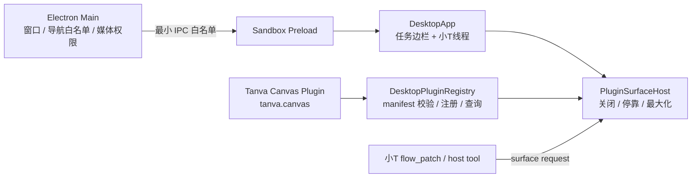

# Electron 与工具面插件实现

> 状态：M1 基础可运行实现（2026-08-21）  
> 目标：以 Codex 式任务外壳承载小T，并把 Tanva 画布及后续专业工作面统一接入为插件。

## 1. 已完成范围

当前桌面版已经具备一条可运行、可打包的基础链路：

- Electron 主进程创建 Tanva 桌面窗口；
- React 在 Electron 环境进入独立的 `DesktopApp`，网页入口保持原状；
- 左侧呈现新任务、搜索、任务历史、扩展和账号区域；
- 每个任务独立保存 `Work / Chat` 类型与项目绑定；新任务默认 Chat，可拖入项目变成 Work，也可拖回 Chat；Electron 会话保存在全局任务存储，打开画布项目不会再用项目内会话重置任务列表；
- `WORK` 标题右侧 `+` 是项目创建唯一入口；Work、Chat 和每个项目目录均可折叠，拖入任务自动展开完整目录路径；项目行只负责展开/收起，项目 `…` 支持置顶/重命名/删除，删除项目时绑定任务迁回 Chat；桌面运行时不自动创建或补建“未命名项目”；
- 项目行常驻的 `+` 可直接在该项目发起任务：创建会话、绑定项目、展开目录并切换当前任务一次完成；
- 项目、任务、扩展与账号菜单在点击外部、窗口失焦或按 Escape 时关闭；重命名失焦保存，空的新建输入失焦取消；
- 已接通 `⌘K` 搜索及上下选择、`⌘N` 新任务、`⌘B` 显隐侧栏；项目和会话支持置顶，会话支持重命名、跨项目移动、移回 Chat、归档/恢复及删除；
- 中间复用真实小T会话，并以嵌入式形态呈现现有 `AIChatDialog`；
- 右侧由统一 `PluginSurfaceHost` 承载当前工具面，支持拖宽、最大化、恢复和关闭；
- 现有 Tanva 画布以 `tanva.canvas` 第一方内置插件注册；
- 当前任务顶栏提供唯一“画布 / 隐藏”手动开关，按钮强制单行；用户手动隐藏后，本轮小T后续画布补丁不得重新顶开，下一条用户指令才恢复自动唤起；
- 画布的 `embeddedDesktop` 模式不渲染网页项目头、账号/积分导航、Focus 全局模式或第二套小T，fixed 画布工具浮层全部锚定插件容器；
- 本机应用连接中心以 `tanva.desktop-connectors` 第二个第一方内置插件注册；
- PPT、Excel 和文档以 `tanva.artifacts` 文件工作台注册；PPT 支持逐页缩略图、大页预览、HTML/PPTX 导出并可交接回画布编辑，Excel 支持多工作表预览与 XLSX 导出；
- 左下角账号区统一显示个人/团队、余额和团队切换，团队变化会刷新项目与计费上下文；
- 登录后由 Electron `safeStorage` 加密保存设备令牌；下次启动先恢复本地用户与令牌，再后台续期，不闪回登录页。旧 localStorage 令牌会自动迁移；显式退出只撤销当前设备会话，不影响同账号其他网页/桌面设备；
- Capability Host 使用官方 MCP TypeScript Client，通过 stdio 启动用户导入的本机服务、完成握手、发现工具和断开；
- 小T只查询真实已连接工具，调用时 Electron Main 必须逐次弹出确认；取消不执行，返回值只允许受限文本穿过 IPC；
- 小T收到 `flow_patch` 或执行 `create_presentation` / `edit_presentation` 时，自动请求打开画布工具面；
- 生产构建和 macOS arm64 未签名 `.app` 打包链路已验证；桌面构建使用相对资源基址与 Hash Router，兼容打包后的 `file://` 加载。

本轮没有实现外部插件下载、第三方代码动态执行、插件签名、自动更新或独立 Utility Process。当前 Capability Host 位于 Electron Main；“多插件”指多个随应用编译发布、遵循同一合同的可信工具面，不把未经验证的远程脚本加载进 Renderer。

## 2. 运行结构



桌面主进程不获得画布业务逻辑。插件 UI 仍在沙箱化 Renderer 中运行，系统能力只能通过预加载层暴露的白名单 IPC 使用。当前预加载层开放窗口控制，以及经过固定应用 ID 校验的本机应用检测、路径选择、启动、MCP 连接和受确认工具调用。路径与无密钥 MCP 配置由 Main 保存在 `userData/connectors.json`；Renderer 不获得任意文件系统、子进程或 Shell 能力。MCP command/cwd 必须是绝对路径，配置内密钥字段会被拒绝。

## 3. 关键代码位置

| 位置 | 职责 |
|---|---|
| `electron/main.mjs` | BrowserWindow、安全导航、外链、媒体权限与窗口 IPC |
| `electron/preload.cjs` | 通过 `contextBridge` 暴露最小桌面 API |
| `electron/capability-host.mjs` | MCP stdio 生命周期、工具发现、风险分类和结果清洗 |
| `electron-builder.yml` | 独立最小 Electron runtime、渲染资源与跨平台目标 |
| `src/desktop/DesktopApp.tsx` | 桌面入口和全局运行时挂载 |
| `src/desktop/DesktopShell.tsx` | 任务外壳和插件工具面布局 |
| `src/desktop/DesktopSidebar.tsx` | 任务历史、搜索、扩展信息和账号区域 |
| `src/desktop/DesktopTaskThread.tsx` | 当前项目上下文与嵌入式小T线程 |
| `src/desktop/taskContextState.ts` | Work/Chat 与任务到项目的持久化绑定 |
| `src/desktop/plugins/types.ts` | 插件 manifest、权限和组件 Props 合同 |
| `src/desktop/plugins/registry.ts` | 注册、校验、注销、查询和订阅 |
| `src/desktop/plugins/surfaceState.ts` | 当前插件、停靠模式和宽度持久化 |
| `src/desktop/plugins/PluginSurfaceHost.tsx` | 插件渲染、错误隔离、尺寸和标题栏 |
| `src/desktop/plugins/builtins/TanvaCanvasPlugin.ts` | `tanva.canvas` manifest |
| `src/desktop/plugins/builtins/TanvaCanvasSurface.tsx` | 现有 Canvas 的插件适配层 |
| `src/desktop/plugins/builtins/ArtifactWorkspaceSurface.tsx` | PPT、Excel、文档的独立文件工作台 |
| `src/desktop/artifacts/spreadsheetExport.ts` | 浏览器内生成真实 XLSX 包 |
| `src/desktop/plugins/builtins/DesktopConnectorsPlugin.ts` | 本机应用连接插件 manifest |
| `src/desktop/plugins/builtins/DesktopConnectorsSurface.tsx` | 检测、配置和启动专业应用的管理面 |
| `src/desktop/plugins/surfaceEvents.ts` | 小T/宿主请求打开工具面的统一事件 |

## 4. 插件合同

每个工具面插件由稳定 manifest 和一个 React 组件组成：

```ts
const examplePlugin: DesktopPluginDefinition = {
  manifest: {
    schemaVersion: 1,
    id: 'tanva.example',
    name: '示例工具',
    version: '1.0.0',
    description: '示例专业工作面',
    capabilities: ['example.inspect'],
    permissions: ['project:read'],
    surface: {
      title: '示例工具',
      defaultWidth: 720,
      minWidth: 480,
      maxWidth: 1200,
      supportsMaximize: true,
    },
  },
  component: ExampleSurface,
};
```

注册表会拒绝以下输入：

- schema 版本不受支持；
- 不稳定或包含空格的大写插件 ID；
- 不符合语义版本格式的版本号；
- 缺少名称或表面标题；
- 小于宿主安全下限、默认值越界或最大值小于默认值的宽度合同；
- 与现有插件重复的 ID。

新增可信内置插件时，应在 `src/desktop/plugins/builtins/` 定义插件，再由 `registerBuiltinDesktopPlugins()` 注册。主框架不应按插件名称写条件分支；打开工具面统一调用：

```ts
requestDesktopSurface({
  pluginId: 'tanva.example',
  mode: 'docked',
  reason: 'xiaot-tool-call',
});
```

## 5. 唯一入口如何落实

- “扩展”只展示和管理已安装插件，不作为创作能力启动器；只有确实需要用户配置的连接器显示一个“管理”入口；
- 当前任务标题栏只提供一个“画布 / 隐藏”手动开关，不提供其他画布或插件快捷按钮；
- 小T调用对应能力时自动打开同一个工具面；精确“打开/展开/收起/关闭画布”命令由桌面宿主本地完成，不请求模型；
- 已有工具结果可通过同一任务活动执行“定位结果”，它是结果定位，不是第二个能力启动入口；
- 最大化、恢复和关闭只存在于当前工具面标题栏；
- 画布插件内部关闭了第二个小T浮窗，避免任务线程和画布各出现一套聊天入口。

## 6. 安全边界

- `contextIsolation=true`、`sandbox=true`、`nodeIntegration=false`、`webSecurity=true`；
- 只允许当前打包渲染目录或显式开发 Origin 导航；
- 新窗口一律拒绝，HTTP(S) 链接交给系统浏览器；
- 媒体权限只对受信应用页面开放，且只允许音频/视频；
- Renderer 不直接获得 Node、文件系统、Shell 或任意 IPC；
- 本机应用 IPC 只接受 `sketchup/rhino/grasshopper/autocad/photoshop` 固定 ID；用户选择的路径在 Main 侧验证存在后保存，启动前再次解析；
- MCP 工具按名称归类为只读、写入、破坏性和脚本执行；无论级别，每次调用都由 Main 原生确认框授权一次；
- MCP 返回的图片/音频等二进制内容不穿过 IPC，文本限制长度并清除 `data:`、`blob:` 与长 base64，防止进入会话/设计持久化；
- Electron runtime 使用独立零依赖 package，避免把前端构建依赖装入应用；
- Tanva 画布现有设计 JSON 约束不变：正式持久化只保存远程 URL/路径引用，禁止 `data:`、`blob:` 和裸 base64。

外部插件生态启用前，还必须完成签名和完整性验证、权限确认、版本兼容、撤销机制、独立进程隔离、资源额度、网络域白名单和审计日志。没有这些边界时，不加载第三方代码。

## 7. 开发、验证与打包

```bash
cd frontend
npm run dev:desktop
npm run verify:desktop
npm run verify:desktop-shell
npm run pack:desktop
```

- `dev:desktop` 同时启动 Vite 和 Electron；
- `verify:desktop` 检查主进程/预加载脚本语法，并运行 manifest、重复注册和工具面宽度测试；
- `verify:desktop-shell` 在开发构建中运行真实浏览器验收，覆盖桌面任务壳、Work/Chat、插件注册、唯一管理入口、内嵌画布、文件工作台、连接器工具面和 `⌘K`；开发预览分支由 `import.meta.env.DEV` 编译门禁，生产构建不存在认证绕过；
- `build:desktop-renderer` 强制使用 `VITE_DESKTOP_BUILD=1` 生成 `./assets/...` 相对路径，并在打包前拒绝任何根绝对资源引用，防止 Electron 窗口启动后因 `file://` 找不到脚本而白屏；
- `pack:desktop` 先构建前端，再产生未签名的本机目录包；
- `build:desktop` 产生平台安装包，正式分发前仍需完成 Apple/Windows 签名、公证与更新通道配置。

Electron 冒烟模式会在页面加载后等待真实 React 渲染，并要求 `#root` 具有子节点与非空文本，同时验证连接器 IPC 返回五个内置连接器。仅存在空 `#root` 不再被视为启动成功。Main 进程也会记录 `did-fail-load` 和 Renderer warning/error，便于定位安装包环境特有问题。

macOS arm64 验证产物位于 `frontend/release/mac-arm64/Tanva.app`。该目录属于本地构建产物，不应提交版本库。

## 8. 下一阶段

1. 为五类专业应用锁定并审计具体开源桥接版本，提供签名安装器和真实软件版本矩阵；
2. 在 stdio 之外补充 Streamable HTTP；旧 SSE 只作为受限兼容层；
3. 把 MCP 工具活动统一接到 `pluginId + action + resourceId`，保存调用证据、目标文档版本和结果资产；
4. 将 Capability Host 进一步移入独立 Utility Process，增加 CPU/内存/超时/崩溃恢复和输出目录隔离；
5. 增加本地项目 RAG、macOS/Windows 签名、公证、自动更新与回滚；
6. 扩充真实 SketchUp/Rhino/AutoCAD/Photoshop 的写入、撤销和交付证据回归。
