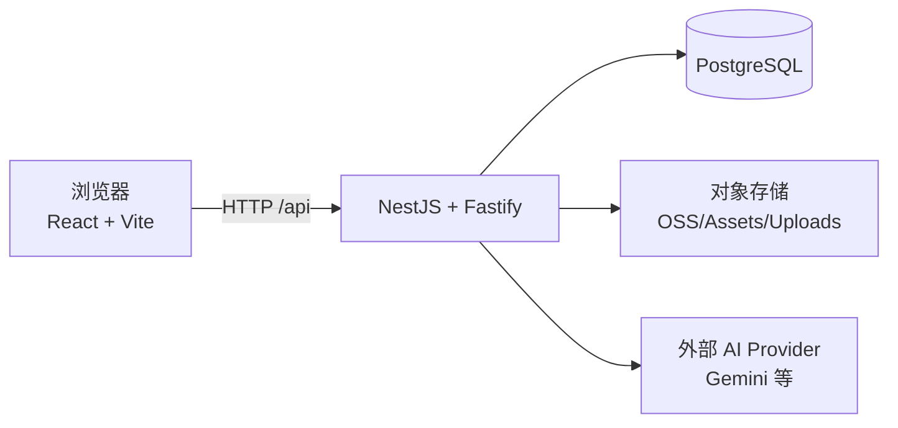

# 架构设计

## 总览

## 前端
- 使用 React Router 进行路由，受保护路由通过 `ProtectedRoute` 控制。
- 画布/流程相关能力主要位于 `frontend/src/components/`，并通过 `services/` 与后端交互。

## 后端
- NestJS + Fastify adapter，启用压缩、Helmet、Cookie、Multipart、CORS。
- 全局前缀 `/api`，Swagger 暴露在 `/api/docs`。
- Prisma 负责数据访问，数据源通过 `DATABASE_URL` 连接 PostgreSQL。

## 关键关注点
- 认证：Cookie + JWT（以代码为准，见 `backend/src/auth/*`）
- 代理：启动时为 undici 配置 ProxyAgent，解决 Node.js 20+ 下部分库代理问题（见 `backend/src/main.ts`）
- 大请求体：后端 `bodyLimit` 放宽至 200MB（适配项目内容）

